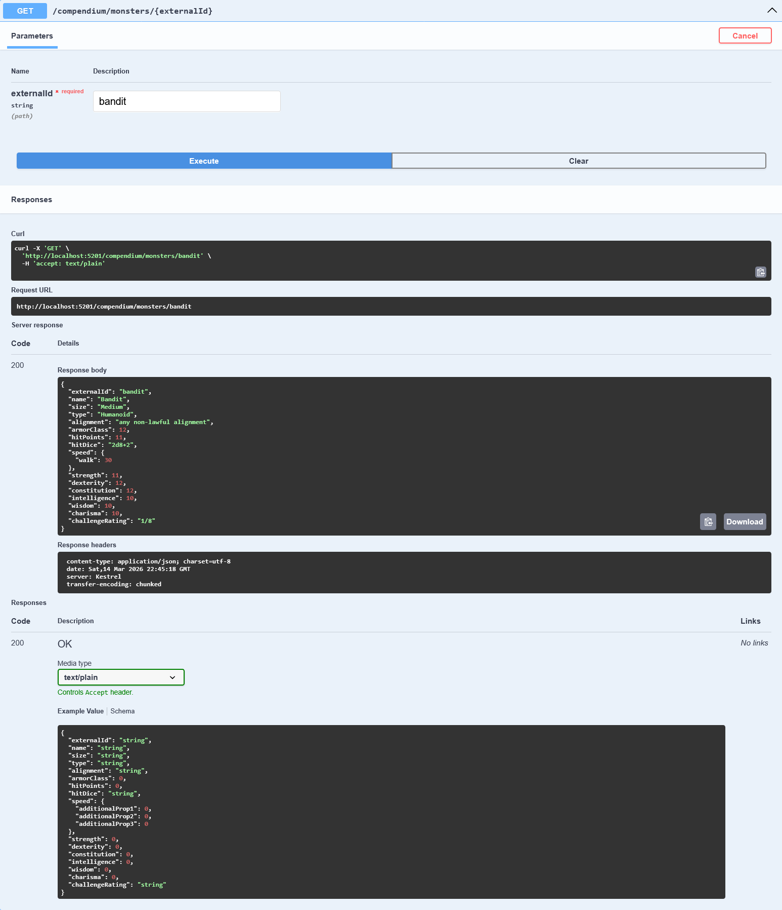

# Dungeon Master Compendium

Dungeon Master Compendium is a backend-first compendium API built with ASP.NET Core.

It is a portfolio project focused on demonstrating:

- clean API design
- layered backend architecture
- external API integration
- Redis caching
- deterministic cache keys
- automated tests
- structured JSON endpoints for D&D compendium data

The API wraps the **Open5e API** and exposes normalized internal contracts for:

- Monsters
- Spells
- Items

---

## Screenshots

### Swagger UI overview

### Monster detail example

### Redis cache keys

---

## What the API Does

Dungeon Master Compendium acts as a **clean backend wrapper over the Open5e API**.

Instead of exposing raw Open5e responses, the API:

- normalizes external responses
- exposes internally-owned response contracts
- adds validation and consistent error handling
- caches responses in Redis

Each compendium resource supports:

- list queries
- name filtering
- detail lookup by `externalId`

---

## Example Demo Flow

A reviewer can test the project with the following flow:

1. `GET /compendium/monsters?limit=10`
2. `GET /compendium/monsters?name=kobold&limit=10`
3. `GET /compendium/monsters/bandit`
4. `GET /compendium/spells?limit=10`
5. `GET /compendium/spells/fireball`
6. `GET /compendium/items?limit=10`
7. `GET /compendium/items/bag-of-holding`

Repeating the same request twice demonstrates **Redis cache reuse**.

---

## Main Endpoints

Base route:

`/compendium`

### Monsters

- `GET /compendium/monsters?limit=10`
- `GET /compendium/monsters?name=kobold&limit=10`
- `GET /compendium/monsters/{externalId}`

### Spells

- `GET /compendium/spells?limit=10`
- `GET /compendium/spells?name=magic&limit=10`
- `GET /compendium/spells/{externalId}`

### Items

- `GET /compendium/items?limit=10`
- `GET /compendium/items?name=sword&limit=10`
- `GET /compendium/items/{externalId}`

---

## Validation Rules

List endpoints enforce:

- `limit` must be between **1 and 100**
- `name` must be **50 characters or less**

Detail endpoints enforce:

- `externalId` must not be empty after normalization
- unknown `externalId` returns **404 Not Found**

Example invalid requests:

`GET /compendium/monsters?limit=0`  
`GET /compendium/spells?limit=101`  
`GET /compendium/items?name=<51 characters>`

These return **400 Bad Request**.

---

## Redis Caching

This API uses a **cache-aside strategy** with Redis.

Flow:

Request  
→ check Redis cache  
→ cache miss → call Open5e  
→ store result in Redis  
→ return response  

All cached entries use:

`AbsoluteExpirationRelativeToNow = 10 minutes`

---

## Cache Key Examples

Cache keys are deterministic so equivalent normalized requests reuse the same entry.

Examples:

`dmcomp:monsters:list:name:kobold:limit:10`  
`dmcomp:monsters:detail:bandit`  

`dmcomp:spells:list:name:magic:limit:10`  
`dmcomp:spells:detail:fireball`  

`dmcomp:items:list:name:sword:limit:10`  
`dmcomp:items:detail:bag-of-holding`

Inspect Redis keys with:

`docker exec -it redis redis-cli KEYS "dmcomp:*"`

---

## Tech Stack

- **C# / .NET 8**
- **ASP.NET Core Web API**
- **Redis**
- **Open5e API**
- **xUnit**

---

## Architecture

The solution is structured around a layered architecture.

### Controllers

Responsibilities:

- HTTP endpoints
- request validation
- mapping HTTP responses

### Services

Responsibilities:

- orchestration logic
- cache interaction
- calling Open5e clients
- mapping external DTOs to internal contracts

### Integrations

Responsibilities:

- typed HTTP clients for Open5e
- external API DTOs
- Open5e communication

### Contracts

Responsibilities:

- internal response models
- preventing external schema leakage

---

## Running Locally

### 1. Restore and build

dotnet restore  
dotnet build  

### 2. Start Redis

docker run -d --name redis -p 6379:6379 redis

### 3. Run the API

dotnet run --project .\DungeonMasterCompendium.Api\DungeonMasterCompendium.Api.csproj

### 4. Open Swagger

http://localhost:5201/swagger

---

## Running Tests

dotnet test

The test suite covers core service-layer behavior using fake dependencies.

Covered scenarios include:

- successful list queries
- successful detail queries
- validation failures
- Redis cache interaction
- Open5e integration mapping

---

## Project Scope / Limitations

This project is intentionally scoped as a backend portfolio project.

### Included

- Open5e integration
- internal API contracts
- Redis caching
- validation behavior
- service-layer tests

### Deferred / intentionally not included

- authentication / authorization
- database persistence
- frontend client
- rate limiting
- production deployment infrastructure

---

## Why This Project Exists

Dungeon Master Compendium was built as a focused backend project to demonstrate practical skills in:

- C#
- ASP.NET Core
- external API integration
- Redis caching
- clean layered architecture
- automated testing

The goal was to implement a realistic API wrapper that demonstrates production-style patterns without unnecessary complexity.

---

## Project Status

Feature-complete for the intended scope.

Possible future extensions could include:

- additional compendium resources
- persistent caching
- authentication
- cloud deployment
