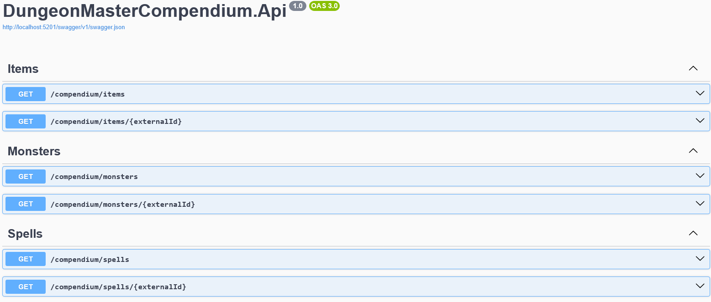
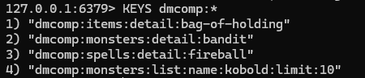

# Dungeon Master Compendium

Dungeon Master Compendium is an ASP.NET Core API that wraps the Open5e API and exposes normalized contracts for monsters, spells, and items.

I built this project to practice working with an external API and Redis caching without turning it into a much bigger app.

The goal was to keep the scope focused: fetch compendium data from Open5e, validate requests, normalize the responses, and cache repeated lookups in Redis.

Open5e is an open-source 5e rules/content resource that provides API access to monsters, spells, items, and other SRD/OGL data, and this project wraps a small part of that API behind its own contracts and caching layer.

Official API docs: [Open5e API docs](https://open5e.com/api-docs)

---

## Screenshots

### Swagger UI overview


### Monster detail example


### Redis cache keys


---

## What the API Covers

This API acts as a backend wrapper over Open5e.

Instead of returning raw Open5e responses directly, it:

- normalizes external responses
- exposes internal response contracts
- validates query and route input
- returns consistent HTTP errors
- caches repeated requests in Redis

The API currently covers three resource types:

- Monsters
- Spells
- Items

Each resource supports:

- list queries
- optional name filtering
- detail lookup by `externalId`

---

## Suggested Demo Flow

A users can try the project with this flow:

1. `GET /compendium/monsters?limit=10`
2. `GET /compendium/monsters?name=kobold&limit=10`
3. `GET /compendium/monsters/bandit`
4. `GET /compendium/spells?limit=10`
5. `GET /compendium/spells/fireball`
6. `GET /compendium/items?limit=10`
7. `GET /compendium/items/bag-of-holding`

Repeating the same request twice is an easy way to show Redis cache reuse.

---

## Main Endpoints

Base route:

`/compendium`

### Monsters

- `GET /compendium/monsters?limit=10`
- `GET /compendium/monsters?name=kobold&limit=10`
- `GET /compendium/monsters/{externalId}`

### Spells

- `GET /compendium/spells?limit=10`
- `GET /compendium/spells?name=magic&limit=10`
- `GET /compendium/spells/{externalId}`

### Items

- `GET /compendium/items?limit=10`
- `GET /compendium/items?name=sword&limit=10`
- `GET /compendium/items/{externalId}`

---

## Validation Rules

List endpoints enforce:

- `limit` must be between **1 and 100**
- `name` must be **50 characters or less**

Detail endpoints enforce:

- `externalId` must not be empty after normalization
- unknown `externalId` returns **404 Not Found**

Examples of invalid requests:

`GET /compendium/monsters?limit=0`  
`GET /compendium/spells?limit=101`  
`GET /compendium/items?name=<51 characters>`

These return **400 Bad Request**.

---

## Redis Caching

This project uses a cache-aside approach with Redis.

Request  
→ check Redis cache  
→ cache miss → call Open5e  
→ store result in Redis  
→ return response

Cached entries use:

`AbsoluteExpirationRelativeToNow = 10 minutes`

---

## Cache Key Examples

Cache keys are deterministic, so equivalent normalized requests reuse the same entry.

Examples:

`dmcomp:monsters:list:name:kobold:limit:10`  
`dmcomp:monsters:detail:bandit`  

`dmcomp:spells:list:name:magic:limit:10`  
`dmcomp:spells:detail:fireball`  

`dmcomp:items:list:name:sword:limit:10`  
`dmcomp:items:detail:bag-of-holding`

Inspect Redis keys with:

`docker exec -it redis redis-cli KEYS "dmcomp:*"`

---

## Tech Stack

- C# / .NET 8
- ASP.NET Core Web API
- Redis
- Open5e API
- xUnit

---

## Solution Structure

### Controllers

Responsibilities:

- HTTP endpoints
- request validation
- HTTP response mapping

### Services

Responsibilities:

- orchestration logic
- cache interaction
- calling Open5e clients
- mapping external DTOs to internal contracts

### Integrations

Responsibilities:

- typed HTTP clients for Open5e
- external API DTOs
- Open5e communication

### Contracts

Responsibilities:

- internal response models
- keeping Open5e schemas from leaking into the API surface

---

## Running Locally

### 1. Restore and build

```bash
dotnet restore
dotnet build
```

### 2. Start Redis

```bash
docker run -d --name redis -p 6379:6379 redis
```

### 3. Run the API

```bash
dotnet run --project .\DungeonMasterCompendium.Api\DungeonMasterCompendium.Api.csproj
```

### 4. Open Swagger

`http://localhost:5201/swagger`

---

## Running Tests

```bash
dotnet test
```

The test suite covers service-layer behavior such as:

- successful list queries
- successful detail queries
- validation failures
- Redis cache interaction
- Open5e integration mapping

---

## Scope

This project is intentionally smaller in scope than Void Ledger.

### Included

- Open5e integration
- internal API contracts
- Redis caching
- validation behavior
- service-layer tests

### Not included

- authentication / authorization
- database persistence
- frontend client
- rate limiting
- production deployment infrastructure

---

## What I'd Improve Next

If I kept expanding this project, the next things I would look at are:

- adding logging around cache hits, misses, and upstream failures
- handling upstream rate limits more explicitly
- adding deployment/runtime setup if I wanted to host it publicly
